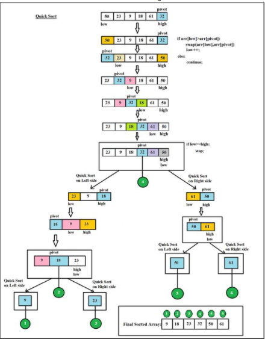

# Quick Sort

## Selection Sort
Quicksort is a sorting algorithm based on the divide and conquer approach where:

1. An array is divided into subarrays by selecting a pivot element (element selected from the array).While dividing the array, the pivot element should be positioned in such a way that elements less than pivot are kept on the left side and elements greater than pivot are on the right side of the pivot.
2. The left and right subarrays are also divided using the same approach. This process continues until each subarray contains a single element.
3. At this point, elements are already sorted. Finally, elements are combined to form a sorted array.
## Pseudocode
    ALGORITHM QuickSort(arr, left, right)
    if left < right
    DEFINE position <-- Partition(arr, left, right)
    QuickSort(arr, left, position - 1)
    QuickSort(arr, position + 1, right)
    ALGORITHM Partition(arr, left, right)
    DEFINE pivot <-- arr[right]
    DEFINE low <-- left - 1
    for i <- left to right do
    if arr[i] <= pivot
    low++
    Swap(arr, i, low)
     Swap(arr, right, low + 1)
     return low + 1

    ALGORITHM Swap(arr, i, low)
    DEFINE temp;
    temp <-- arr[i]
    arr[i] <-- arr[low]
    arr[low] <-- temp

## TRACE : 

