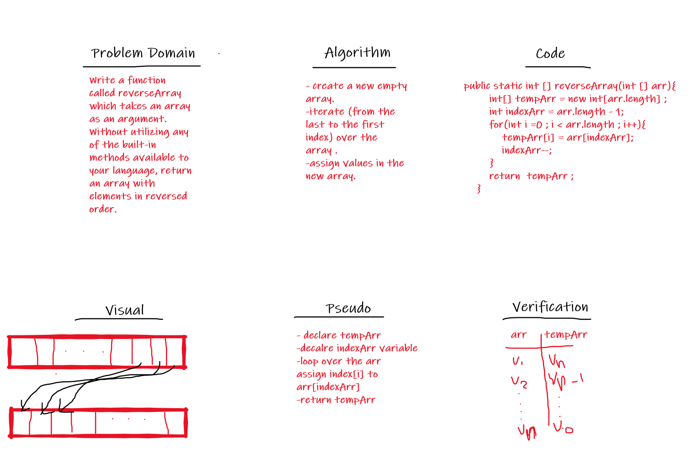

# 401-data-structures-and-algorithms

# [challenge 1 (Reverse Array)](https://github.com/Qusay114/401-data-structures-and-algorithms/blob/main/ArrayReverse-Challenge/src/ArrayReverse.java) :

 
 

# [challenge 2 (Array Insert Shift)](https://github.com/Qusay114/401-data-structures-and-algorithms/blob/main/ArrayInsertShift-challenge/src/ArrayInsertShift.java) :

 
 

# [challenge 3 (Binary Array Search)](https://github.com/Qusay114/401-data-structures-and-algorithms/blob/main/ArrayBinarySearch-Challenge/src/ArrayBinarySearch.java) :

 
 

# [Challenge 5 (LinkedList)](https://github.com/Qusay114/401-data-structures-and-algorithms/tree/main/LinkedList-Challenge/app/src/main/java) :

## Challenge description 
Create a linked list data structure which has these methods :
* insert  --> to add data to your linked list
* include --> to check if the linkedlist has the data or not
* toString --> to convert your linkedlist to a list in a form like this "{ a } -> { b } -> { c } -> NULL"

# [Challenge 6 (append LinkedList)](https://github.com/Qusay114/401-data-structures-and-algorithms/tree/main/LinkedListInsertions-Challenge/app/src/main/java) :

## Challenge description
append to the created LinkedList these methods
* append  --> to add data to the end of your linked list
* insert before --> to insert data before a given value(exists in the linked list)
* insert after --> to insert data after a given value(exists in the linked list)

