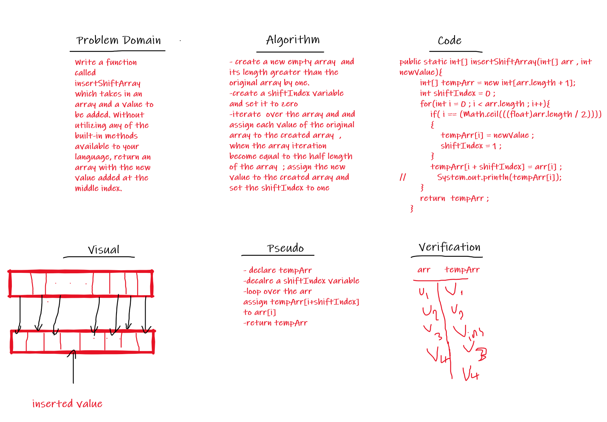

# 401-data-structures-and-algorithms

# [challenge 1 (Reverse Array)](https://github.com/Qusay114/401-data-structures-and-algorithms/blob/main/ArrayReverse-Challenge/src/ArrayReverse.java) :

 
 

# [challenge 2 (Array Insert Shift)](https://github.com/Qusay114/401-data-structures-and-algorithms/blob/main/ArrayInsertShift-challenge/src/ArrayInsertShift.java) :

 
 

# [challenge 3 (Binary Array Search)](https://github.com/Qusay114/401-data-structures-and-algorithms/blob/main/ArrayBinarySearch-Challenge/src/ArrayBinarySearch.java) :

 
 

# challenge 4 (Fibonacci Sequence) :

